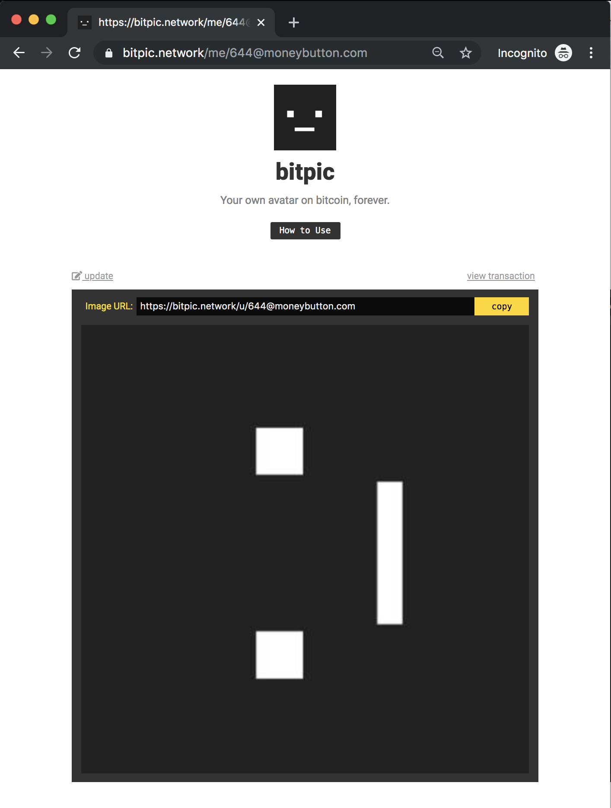

# neonbitpic

> bitcoinless bitpic

Instantly spin up your own [bitpic.network](https://bitpic.network) node in seconds. **No Bitcoin node required. You can even run on your laptop.** 

Powered by [neon planaria](https://neon.planaria.network).



# How it works

Neonbitpic builds the identical state machine as [Gridbitpic](https://github.com/interplanaria/gridbitpic), which becomes [https://bitpic.network](https://bitpic.network).

- **Write:** The [planaria.js](planaria.js) file is the crawler.
- **Read:** The [planarium.js](planarium.js) file is the web endpoint.

Now let's try running your own!


# Start your own Bitpic node in 1 minute

## Step 0. Install Docker

This app is powered by Docker. All you need is to have Docker installed.

## Step 1. Clone this repository

This repository is all you need to run your own Bitpic node.

```
$ git clone https://github.com/interplanaria/neonbitpic.git
$ cd neonbitpic
$ npm install
```

## Step 2. Start Synchronizing

Start the neon planaria crawler to store the transactions to your DB.

```
node neonplanaria
```

That's all! Your DB and file system will start populating.

## Step 3. Run the web endpoint

Start a web server to serve.

```
node planarium
```
